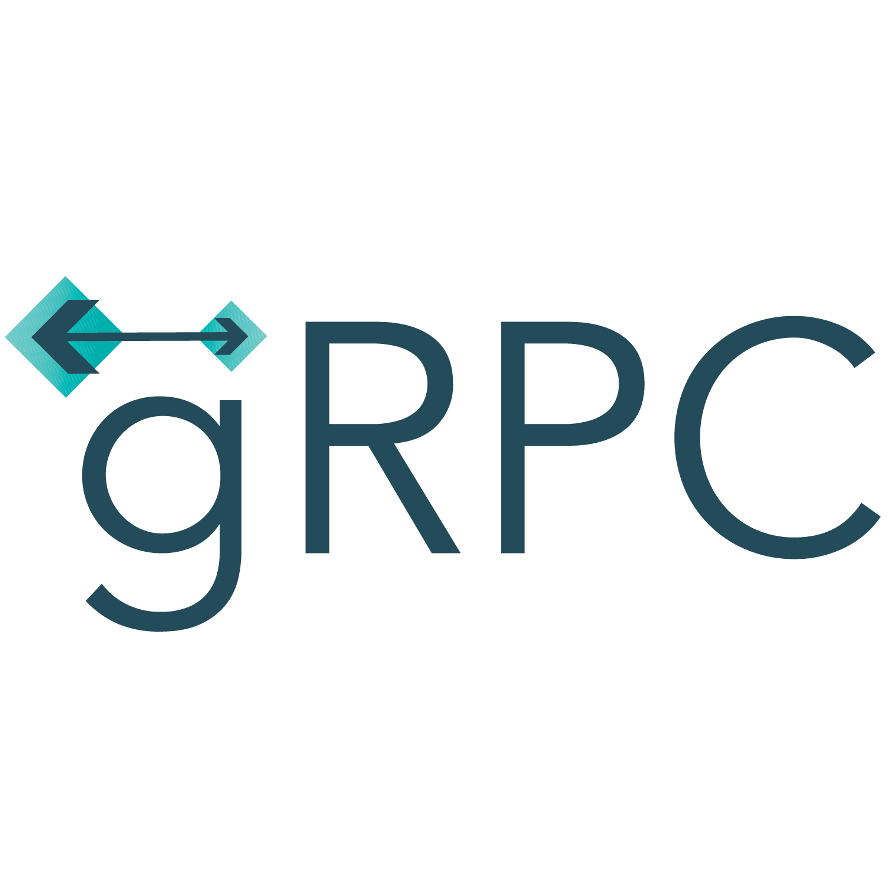

# Learning
<p align="center">
  
</p>

## 📌Overview

### gRPC nima?
gRPC — Google tomonidan ishlab chiqilgan yuqori samarali **Remote Procedure Call (RPC)** framework hisoblanadi.  
U **HTTP/2** protokoliga asoslangan va **Protobuf (Protocol Buffers)** orqali ma’lumot almashadi.  

---

### REST API vs gRPC

| Xususiyat | REST API | gRPC |
|-----------|----------|------|
| Transport protokoli | HTTP/1.1 (odatda JSON) | HTTP/2 (Protobuf) |
| Ma’lumot formati | JSON, XML | Protobuf (binary) |
| Tezlik | JSON parsing sabab sekinroq | Binary format sabab tezroq |
| Contract | Yo‘q (odatda OpenAPI qo‘shiladi) | `.proto` fayl orqali majburiy contract |
| Streaming | Limited (Server-Sent Events yoki WebSocket kerak) | Server, Client va Bidirectional streaming built-in |
| Cross-platform | Ha | Ha (ko‘plab tillar uchun codegen mavjud) |

---

### Asosiy xususiyatlari
- ⚡ **Yuqori tezlik**: Protobuf va HTTP/2 tufayli REST’ga qaraganda ancha tezroq ishlaydi.  
- 📄 **Strongly-typed contract**: `.proto` fayllar orqali interfeys qat’iy belgilanadi.  
- 🔄 **Streaming support**:  
  - Unary RPC (oddiy request/response)  
  - Server streaming  
  - Client streaming  
  - Bidirectional streaming  
- 🌍 **Cross-platform**: C#, Java, Go, Python, Node.js va boshqa ko‘plab tillarni qo‘llab-quvvatlaydi.  
- 🔒 **Security**: TLS/SSL, Authentication va Authorization qo‘llab-quvvatlanadi.  

---

## 📌 Architecture

gRPC arxitekturasi 3 ta asosiy qismdan tashkil topgan: **Protobuf**, **Server & Client**, va **Stub’lar (code generation)**.  

---

### Protobuf (`.proto` files)
**Protocol Buffers (Protobuf)** — bu Google tomonidan ishlab chiqilgan **serialization format** (ma’lumotlarni siqib, tez uzatish uchun format).  

- `.proto` faylda **xizmatlar (services)** va **ma’lumot tuzilmalari (messages)** aniqlanadi.  
- Bu fayl **contract** (kelishuv) hisoblanadi: Server ham, Client ham shu fayl asosida kod generatsiya qiladi.  
- Misol:  
  ```proto
  syntax = "proto3";

  service Greeter {
      rpc SayHello (HelloRequest) returns (HelloReply);
  }

  message HelloRequest {
      string name = 1;
  }

  message HelloReply {
      string message = 1;
  }
  // SayHello methodi HelloRequest jo'natib HelloReply qabul qiladi
- service → qaysi metodlar mavjudligini bildiradi.

- rpc → bitta remote metodni bildiradi.

- message → Client va Server o‘rtasida uzatiladigan ma’lumot strukturalari.

### Stub’lar va Code Generation

**Stub** — bu avtomatik generatsiya qilingan kod bo‘lib, `.proto` fayldan yaratiladi.  

- Client tarafida **stub** chaqirilganda, u aslida tarmoq orqali server bilan gaplashadi.  
- Server tarafida esa **stub** — kutilayotgan metodlarni qabul qilib, siz yozgan logikaga uzatadi.  

---

⚙️ **Code generation**

- `.proto` faylni **`protoc` kompilyatori** orqali turli tillarga (C#, Java, Go, Python, Node.js, va h.k.) kodga aylantirish mumkin.  
- Shu sababli, bitta `.proto` fayl orqali turli tillarda yozilgan **servis** va **klient** bir-biri bilan ishlay oladi.  


## 📌 Communication Types

gRPC 4 xil asosiy aloqa turini qo‘llab-quvvatlaydi. Bularning barchasi **HTTP/2 stream** imkoniyatlaridan foydalanadi.  

---

### 1️⃣ Unary RPC
- **Ta’rif**: Eng oddiy RPC turi. Client **bitta request** yuboradi va Serverdan **bitta javob** oladi.  
- REST’dagi oddiy `GET` yoki `POST` so‘rovlarga o‘xshaydi.  

📌 Misol:
```proto
rpc SayHello (HelloRequest) returns (HelloReply);
```

### 2️⃣ Server streaming RPC

- **Ta’rif**: Client **bitta request** yuboradi, lekin Server unga **bir nechta javoblarni oqim (stream)** sifatida qaytaradi.  
- Client oqimni tugaguncha o‘qib boradi.  

📌 Misol:
```proto
rpc ListUsers (UserFilter) returns (stream User);
```

### 3️⃣ Client streaming RPC

- **Ta’rif**: Client **bir nechta request** yuboradi (stream orqali), lekin Server faqat **bitta javob** qaytaradi.  
- Server barcha requestlarni yig‘ib, keyin javob beradi.  

📌 Misol:
```proto
rpc UploadFiles (stream FileChunk) returns (UploadStatus);
```

### 4️⃣ Bidirectional streaming RPC

- **Ta’rif**: Client ham, Server ham **oqim (stream)** orqali bir nechta xabarlarni bir vaqtda yuborishi va qabul qilishi mumkin.  
- Bu eng kuchli aloqa turi bo‘lib, to‘liq **real-time kommunikatsiya**ni ta’minlaydi.  

📌 Misol:
```proto
rpc Chat (stream ChatMessage) returns (stream ChatMessage);
```

---

### ⚡ Performance
- gRPC **HTTP/2** dan foydalanadi, u esa bitta TCP ulanishida bir nechta so‘rovlarni parallel yuborish imkonini beradi (multiplexing).  
- **Protobuf** ma’lumotlarni siqib yuboradi va JSON’ga qaraganda tezroq ishlaydi.  
- Natijada, gRPC REST’ga nisbatan ancha yuqori samaradorlikka ega.  

---

### 📄 Strong Contract
- `.proto` fayl orqali **aniq contract** belgilanadi.  
- Client va Server bir-biri bilan aniq kelishuv asosida ishlaydi.  
- Xatoliklar soni kamayadi va **type-safety** ta’minlanadi.  
---

### ⚠️ Error handling
- Har bir RPC chaqiruv muvaffaqiyatsiz bo‘lishi mumkin (masalan, tarmoq uzilishi, noto‘g‘ri ma’lumot).  
- gRPC’da **status codes** mavjud (masalan: `OK`, `NOT_FOUND`, `INVALID_ARGUMENT`, `UNAUTHENTICATED` va h.k.).  
- Client tomonida bu kodlarga mos ravishda xatolikni qayta ishlash kerak.  

---

### 🔄 Versioning
- `.proto` fayllarda xabar (message) maydonlari uchun **raqam (tag number)** doimiy bo‘lishi kerak.  
- Yangi maydon qo‘shish → eski client/server bilan muvofiqlikni saqlaydi.  
- Eski maydonni o‘chirib tashlamasdan, uni **deprecated** sifatida belgilash tavsiya etiladi.  

---

### 🔒 Authentication va Authorization
- gRPC **TLS/SSL** orqali xavfsiz ulanishni ta’minlaydi.  
- Qo‘shimcha ravishda, **JWT (JSON Web Token)** yoki OAuth2 orqali foydalanuvchi autentifikatsiyasini amalga oshirish mumkin.  
- Authorization darajasida esa foydalanuvchining ruxsatlari tekshiriladi.  

---

### 📊 Monitoring va Logging
- RPC chaqiruvlarining muvaffaqiyatli/muvaffaqiyatsiz sonini kuzatish uchun **metrics** yig‘ish kerak.  
- **Prometheus** va **Grafana** kabi vositalar bilan integratsiya qilish mumkin.  
- Debug qilish uchun **structured logging** qo‘llash tavsiya etiladi (masalan, `request_id`, `trace_id` ni loglarda ko‘rsatish).  

---
